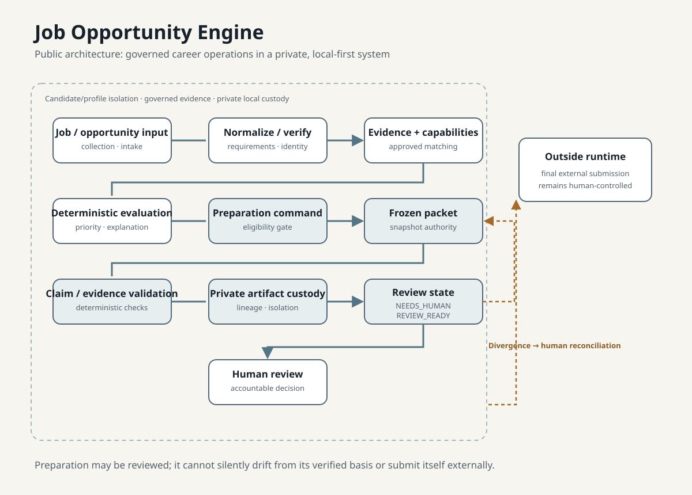

# Job Opportunity Engine

The Job Opportunity Engine addresses a practical problem: a serious career search needs more than generated prose. It needs a reliable way to collect opportunities, inspect requirements, compare them against governed evidence, prioritize work, and keep final external actions under human control.

## Matthew’s role

- System architecture and operating-model definition
- Requirements, workflow, lifecycle/state, and evidence-architecture design
- Evaluation and capability-governance design
- Validation criteria, implementation direction, and AI coding-agent direction

## System model

The public model is a local-first, private operating system for career operations:

1. intake and normalize a job opportunity;
2. verify and deduplicate the record;
3. extract requirements and evaluate fit deterministically;
4. match governed evidence and approved capability assessments;
5. prioritize review-oriented preparation.

The architecture separates evidence from inference, uses deterministic rules for consequential evaluation, and preserves a human decision boundary before any final application submission.

## What the public checkpoint supports

At the latest clean public portfolio checkpoint, the private Python and SQLite foundation was validated by **146 passing tests**. It supports governed job and evaluation workflows, canonical candidate evidence, capability assessment and matching concepts, and application-preparation architecture.

## What is intentionally not claimed

- Broad autonomous external job search is outside the clean public checkpoint.
- Automated final application submission is not a capability claim.
- This repository does not reproduce private runtime code, data, records, or configuration.

## Governance principles

- Keep private candidate evidence isolated.
- Generated output is not authoritative evidence: AI proposes; evidence proves; humans approve.
- Make material evaluation rules inspectable and deterministic.
- Bind capability matching to approved assessments rather than unsupported inference.
- Technical fluency is not software engineering, and application state is distinct from outcome.
- Require human control for consequential external actions.

Read the [public portfolio case study](https://matt-rfs.github.io/matthew-ralph-portfolio/work/job-opportunity-engine/).
