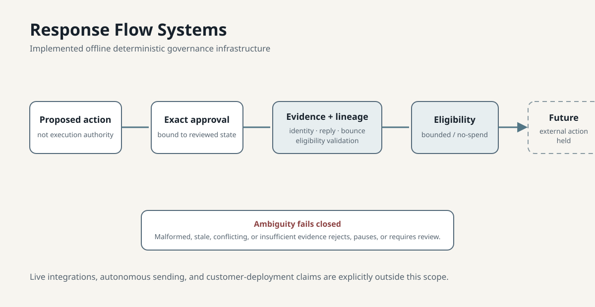

# Response Flow Systems

Response Flow Systems is implemented offline governance infrastructure for outbound approval, evidence custody, message lineage, and fail-closed exception handling.

## Problem

Lead-response operations break when approval, state, evidence, retries, and handoffs are loosely governed. RFS treats those concerns as a reviewable operating system rather than as unattended automation.

## Matthew’s role

- Workflow architecture and operating-model design
- Policy, approval, and custody-control design
- Validation criteria and implementation direction

## Implemented offline scope

The accepted infrastructure supports deterministic governance around:

- exact approval binding;
- evidence eligibility;
- message identity and lineage;
- reply and bounce handling;
- stale, malformed, conflicting, or insufficient evidence that fails closed;
- bounded credit / no-spend eligibility controls.



## Public evidence path

- [Architecture diagram](architecture.svg)
- [Fictional operating walkthrough](synthetic-walkthrough.md)
- [Design decisions](design-decisions.md)
- [Validation snapshot](validation-snapshot.md)
- [Public portfolio case study](https://matt-rfs.github.io/matthew-ralph-portfolio/work/response-flow-systems/)

## Validation

The current accepted offline governance infrastructure is backed by **186 passing Python tests**, plus repository policy guards, Ruff linting, strict Mypy checks, schema validation, fixture validation, and clean diff checks.

## Current boundary

This is offline deterministic outbound governance infrastructure. Live Gmail, Google Sheets, Make, or provider integration; live sends; autonomous execution; customer deployment; and customer ROI remain outside the demonstrated scope.

## Stewardship process

Fragmented historical implementation was inspected, reproduced, separated into governed promotion packages, remediated, validated, and promoted only after authority review. In shorthand:

```text
historical implementation → inspect → reproduce → classify → isolate safe scope
→ remediate → validate → promote to accepted authority
```

This is technical-program governance: establishing a trustworthy, testable accepted scope without turning historical or experimental work into an unsupported production claim.
